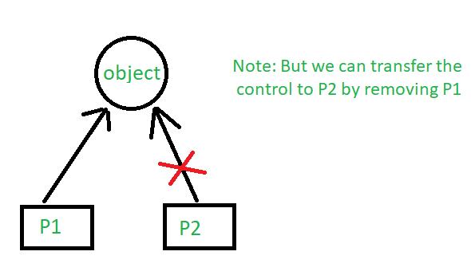
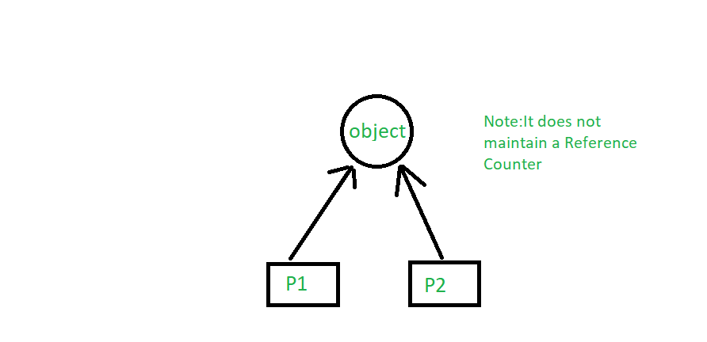

# References and Pointer C++ 

## Why do we need reference variables if we have pointers?

**Pointers**: A pointer is a variable that holds memory address of another variable. A pointer needs to be de referenced with * operator to access the memory location it points to.

**References**: A Reference can be called as a constant pointer that becomes de referenced implicitly. When we access the reference it means we are accessing the storage.

**Why do we need reference variables if we have pointers?**

In Pointers to access the value of the actual variable, we need to explicitly dereference the pointer variable by using ‘**value at address**’ dereferencing operator **(*)**.
In References to access the value of the actual variable, we do not need to explicitly dereference the reference variable, they get de-referenced automatically.

**Pointers and References are equivalent, except**:

- A reference is like a **constant name** for an address. We need to **initialize the reference during the declaration**. Once a reference is established to a variable, we cannot change the reference to reference another variable.
- To get the value **pointed to by a pointer**, we need to use the **dereferencing** operator **(*)**.

> For Example: If **a** is a pointer to integer type, *a returns the value pointed to by a. 
> To assign an address of a variable b into a pointer, we need to use the address-of operator **(&)**.
> For Example: int *a= &b.

- In references, **referencing** and **de-referencing** are done **implicitly**. No explicit de-referencing operator **(*)** and to assign the address of a variable to reference variable, no address-of operator(&).
- A reference variable provides a **new name** to the **existing variable**. It is de-referenced implicitly and does not need a de-referencing operator **(*)** to retrieve the value referenced. **Whereas**, to retrieve the **value pointed to by a pointer** we need de-referencing operator **(*)** which is known as **explicit de-referencing**.
- Reference can be treated as a **constant pointer**. It has to be initialized during declaration and its content cannot be changed.

**Illustration of Pointer and References Variable**


```json
20
26
23
26
18
```

**Illustration of Reference Variable**

Best example of the reference variable is the concept of copy constructor. Copy constructor takes a **reference variable** as an argument, pointer cannot be used here.


```json
a = 5
b = 10
```
## How many levels of pointers can we have in C/C++ {#levelPointer}

A **pointer** is used to point to a memory location of a variable. A pointer stores the address of a variable and the value of a variable can be accessed using dereferencing of the pointer. 

A pointer is generally initialized as: 
 
```c++
datatype *variable name;
```

This above declaration is a single pointer but there can be more than this. This is called **levels of pointers**. According to ANSI C, each compiler must have at least **12 levels** of pointers. This means we can use 12 * symbols with a variable name.

**Level Of Pointers in C/C++**: 
Level of pointers or say chain can go up to N level depending upon the memory size. If you want to create a pointer of **level-5**, you need to precede the pointer variable name by 5 asterisks **(*)** at the time of declaration. 

```c++
// level-1 pointer declaration
datatype *pointer; 

// level-2 pointer declaration
datatype **pointer; 

// level-3 pointer declaration
datatype ***pointer; 
.
.
And so on
```

The level of the pointer depends on how many asterisks the pointer variable is preceded with at the time of declaration.


```c++
int *pointer_1;
int **pointer_2;
int ***pointer_3;
.
.
And so on
```

**Illustrate the various level of pointers**


```output
Value of variable var = 10
Value of variable var using pointer ptr1 = 10
Value of variable var using pointer ptr2 = 10
Value of variable var using pointer ptr3 = 10
```


```output
Value of var = 23.564327
Value of var using level-1 pointer = 23.564327
Value of var using level-2 pointer = 23.564327
Value of var using level-3 pointer = 23.564327
Value of var using level-4 pointer = 23.564327
```

> The above code where we have taken float data type of the variable, so now we have to take the same data type for the chain of pointers too. As the pointer and the variable, it is pointing to should have the same data type.


```output
Before:
Value of var = 10
Value of var using level-1 pointer = 10
Value of var using level-2 pointer = 10
Value of var using level-3 pointer = 10
After:
Value of var = 35
Value of var using level-1 pointer = 35
Value of var using level-2 pointer = 35
Value of var using level-3 pointer = 35
```

> As we already know that a pointer points to address the location of a variable so when we access the value of a pointer that points to the variable’s value. Now to update the value of the variable, we can use any level of pointer as ultimately every pointer is directly or indirectly pointing to that variable only. It will directly change the value present at the address location of the variable.


## Applications of Pointers in C/C++

- **To pass arguments by reference**. Passing by reference serves two purposes

  - **To modify variable of function in other**. Example to swap two variables; 

    ```c++
    // C program to demonstrate that we can change
    // local values of one function in another using pointers.

    #include <stdio.h>

    void swap(int* x, int* y)
    {
	    int temp = *x;
	    *x = *y;
	    *y = temp;
    }

    int main()
    {
	    int x = 10, y = 20;
	    swap(&x, &y);
	    printf("%d %d\n", x, y);
	    return 0;
    }
    ```
    ```output
    20 10
    ```
  - **For efficiency purpose**: Example passing large structure without reference would create a copy of the structure (hence wastage of space).

- **For accessing array elements**. Compiler internally uses pointers to access array elements. 

    ```c++
    // C program to demonstrate that compiler
    // internally uses pointer arithmetic to access
    // array elements.

    #include <stdio.h>

    int main()
    {
        int arr[] = { 100, 200, 300, 400 };

        // Compiler converts below to *(arr + 2).
        printf("%d ", arr[2]);

        // So below also works.
        printf("%d\n", *(arr + 2));

        return 0;
    }
    ```
    ```output
    300 300
    ```

- **To return multiple values**. Example returning square and square root of numbers

    ```c++
    // C program to demonstrate that using a pointer
    // we can return multiple values.

    #include <math.h>
    #include <stdio.h>

    void fun(int n, int* square, double* sq_root)
    {
    *square = n * n;
    *sq_root = sqrt(n);
    }

    int main()
    {

    int n = 100;
    int sq;
    double sq_root;
    fun(n, &sq, &sq_root);

    printf("%d %f\n", sq, sq_root);
    return 0;
    }
    ```
    ```output
    10000 10
    ```

- [**Dynamic memory allocation**](https://www.geeksforgeeks.org/dynamic-memory-allocation-in-c-using-malloc-calloc-free-and-realloc/) : We can use pointers to dynamically allocate memory. The advantage of dynamically allocated memory is, it is not deleted until we explicitly delete it 

    ```c++
    // C program to dynamically allocate an
    // array of given size.

    #include <stdio.h>
    #include <stdlib.h>
    int* createArr(int n)
    {
        int* arr = (int*)(malloc(n * sizeof(int)));
        return arr;
    }

    int main()
    {
        int* pt = createArr(10);
        return 0;
    }
    ```

## Pointers in C and C++ | Set 1 (Introduction, Arithmetic and Array)

Pointers store address of variables or a memory location. 

```c++
// General syntax
datatype *var_name; 

// An example pointer "ptr" that holds
// address of an integer variable or holds
// address of a memory whose value(s) can
// be accessed as integer values through "ptr"
int *ptr;  
```

**Using a Pointer:**


To use pointers in C, we must understand below two operators. 
 
  - To access address of a variable to a pointer, we use the unary operator **&** (ampersand) that returns the address of that variable. For example &x gives us address of variable x.
  
    ```c
    // The output of this program can be different
    // in different runs. Note that the program
    // prints address of a variable and a variable
    // can be assigned different address in different
    // runs.
    #include <stdio.h>

    int main()
    {
        int x;

        // Prints address of x
        printf("%p", &x);

        return 0;
    }
    ```

  - One more operator is <b>unary *</b> (Asterisk) which is used for two things: 
    
    - To declare a pointer variable: When a pointer variable is declared in C/C++, there must be a * before its name. 

        ```c++
        // C program to demonstrate declaration of
        // pointer variables.
        #include <stdio.h>
        int main()
        {
            int x = 10;

            // 1) Since there is * in declaration, ptr
            // becomes a pointer variable (a variable
            // that stores address of another variable)
            // 2) Since there is int before *, ptr is
            // pointer to an integer type variable
            int *ptr;

            // & operator before x is used to get address
            // of x. The address of x is assigned to ptr.
            ptr = &x;

            return 0;
        }
        ```

    - To access the value stored in the address we use the unary operator (*) that returns the value of the variable located at the address specified by its operand. This is also called **Dereferencing**.

        ```c++
        // C++ program to demonstrate use of * for pointers in C++
        #include <iostream>
        using namespace std;

        int main()
        {
            // A normal integer variable
            int Var = 10;

            // A pointer variable that holds address of var.
            int *ptr = &Var;

            // This line prints value at address stored in ptr.
            // Value stored is value of variable "var"
            cout << "Value of Var = "<< *ptr << endl;

            // The output of this line may be different in different
            // runs even on same machine.
            cout << "Address of Var = " << ptr << endl;

            // We can also use ptr as lvalue (Left hand
            // side of assignment)
            *ptr = 20; // Value at address is now 20

            // This prints 20
            cout << "After doing *ptr = 20, *ptr is "<< *ptr << endl;

            return 0;
        }
        ```

        ```output
        Value of Var = 10
        Address of Var = 0x7fffa057dd4
        After doing *ptr = 20, *ptr is 20
        ```

**Pointer Expressions and Pointer Arithmetic** 

A limited set of arithmetic operations can be performed on pointers. A pointer may be: 
 

- incremented ( ++ )
- decremented ( — )
- an integer may be added to a pointer ( + or += )
- an integer may be subtracted from a pointer ( – or -= )

Pointer arithmetic is meaningless unless performed on an array. 

> Note : Pointers contain addresses. Adding two addresses makes no sense, because there is no idea what it would point to. Subtracting two addresses lets you compute the offset between these two addresses.

```c++
// C++ program to illustrate Pointer Arithmetic
// in C/C++
#include <bits/stdc++.h>

// Driver program
int main()
{
	// Declare an array
	int v[3] = {10, 100, 200};

	// Declare pointer variable
	int *ptr;

	// Assign the address of v[0] to ptr
	ptr = v;

	for (int i = 0; i < 3; i++)
	{
		printf("Value of *ptr = %d\n", *ptr);
		printf("Value of ptr = %p\n\n", ptr);

		// Increment pointer ptr by 1
		ptr++;
	}
}
```

```output
Output:Value of *ptr = 10
Value of ptr = 0x7ffcae30c710

Value of *ptr = 100
Value of ptr = 0x7ffcae30c714

Value of *ptr = 200
Value of ptr = 0x7ffcae30c718
```


**Array Name as Pointers** 

An array name acts like a pointer constant. The value of this pointer constant is the address of the first element. 
For example, if we have an array named val then **val** and **&val[0]** can be used interchangeably. 

```c++
// C++ program to illustrate Array Name as Pointers in C++
#include <bits/stdc++.h>
using namespace std;

void geeks()
{
	// Declare an array
	int val[3] = { 5, 10, 15};

	// Declare pointer variable
	int *ptr;

	// Assign address of val[0] to ptr.
	// We can use ptr=&val[0];(both are same)
	ptr = val ;
	cout << "Elements of the array are: ";
	cout << ptr[0] << " " << ptr[1] << " " << ptr[2];

	return;
}

// Driver program
int main()
{
	geeks();
	return 0;
}
```

```output
Output:
Elements of the array are: 5 10 15
```


Now if this ptr is sent to a function as an argument then the array val can be accessed in a similar fashion. 


**Pointers and Multidimensional Arrays**

Consider pointer notation for the two-dimensional numeric arrays. consider the following declaration

```c++
int nums[2][3]  =  { {16, 18, 20}, {25, 26, 27} };
```

> In general, nums[i][j] is equivalent to `*(*(nums+i)+j)`

| Pointer Notation      | Array Notation | Value     |
| :---        |    :----:   |          ---: |
| `*(*nums)`     | nums[0][0]       | 16   |
| `*(*nums + 1)`   | nums[0][1]        | 18      |
| `*(*nums + 2)`   | nums[0][2]        | 20      |
| `*(*(nums + 1))`    | nums[1][0]       | 25   |
| `*(*(nums + 1) + 1)`     | nums[1][1]       | 26  |
| `*(*(nums + 1) + 2)`   | nums[1][2]        | 27  |


## Opaque Pointer

**What is an opaque pointer?**

Opaque as the name suggests is something we can’t see through. e.g. wood is opaque. Opaque pointer is a pointer which points to a data structure whose contents are not exposed at the time of its definition.

Following pointer is opaque. One can’t know the data contained in STest structure by looking at the definition.

```c
struct STest* pSTest;
```

It is safe to assign NULL to an opaque pointer.

```c
pSTest = NULL; 
```

**Why Opaque pointer?**
There are places where we just want to hint the compiler that “Hey! This is some data structure which will be used by our clients. Don’t worry, clients will provide its implementation while preparing compilation unit”. Such type of design is robust when we deal with shared code.


## References in C++

When a variable is declared as a reference, it becomes an alternative name for an existing variable. A variable can be declared as a reference by putting ‘&’ in the declaration.

```c++
#include<iostream>
using namespace std;

int main()
{
int x = 10;

// ref is a reference to x.
int& ref = x;

// Value of x is now changed to 20
ref = 20;
cout << "x = " << x << endl ;

// Value of x is now changed to 30
x = 30;
cout << "ref = " << ref << endl ;

return 0;
}
```

```output
x = 20
ref = 30
```

**Applications :**  

- **Modify the passed parameters in a function**: If a function receives a reference to a variable, it can modify the value of the variable. For example, the following program variables are swapped using references.

    ```c++
    #include<iostream>
    using namespace std;

    void swap (int& first, int& second)
    {
        int temp = first;
        first = second;
        second = temp;
    }

    int main()
    {
        int a = 2, b = 3;
        swap( a, b );
        cout << a << " " << b;
        return 0;
    }

    ```

    ```output
    3 2
    ```

- **Avoiding a copy of large structures**: Imagine a function that has to receive a large object. If we pass it without reference, a new copy of it is created which causes wastage of CPU time and memory. We can use references to avoid this.

    ```c++
    struct Student {
    string name;
    string address;
    int rollNo;
    }

    // If we remove & in below function, a new
    // copy of the student object is created.
    // We use const to avoid accidental updates
    // in the function as the purpose of the function
    // is to print s only.
    void print(const Student &s)
    {
        cout << s.name << " " << s.address << " " << s.rollNo;
    }
    ```

- **In For Each Loops to modify all objects** : We can use references in for each loops to modify all elements.

    ```c++
    #include <bits/stdc++.h>
    using namespace std;

    int main()
    {
        vector<int> vect{ 10, 20, 30, 40 };

        // We can modify elements if we
        // use reference
        for (int &x : vect)
            x = x + 5;

        // Printing elements
        for (int x : vect)
        cout << x << " ";

        return 0;
    }
    ```

- **For Each Loop to avoid the copy of objects**: We can use references in each loop to avoid a copy of individual objects when objects are large.  

    ```c++
    #include <bits/stdc++.h>
    using namespace std;

    int main()
    {
        vector<string> vect{"geeksforgeeks practice",
                        "geeksforgeeks write",
                        "geeksforgeeks ide"};

        // We avoid copy of the whole string
        // object by using reference.
        for (const auto &x : vect)
        cout << x << endl;

        return 0;
    }
    ```

**References vs Pointers:**

Both references and pointers can be used to change local variables of one function inside another function. Both of them can also be used to save copying of big objects when passed as arguments to functions or returned from functions, to get efficiency gain. Despite the above similarities, there are the following differences between references and pointers.

- A pointer can be declared as void but a reference can never be void For example

    ```c++
    int a = 10;
    void* aa = &a;. //it is valid
    void &ar = a; // it is not valid
    ```

- The pointer variable has n-levels/multiple levels of indirection i.e. single-pointer, double-pointer, triple-pointer. Whereas, the reference variable has only one/single level of indirection. [Read above](#levelPointer)

- Reference variable cannot be updated.
- Reference variable is an internal pointer .
- Declaration of Reference variable is preceded with ‘&’ symbol ( but do not read it as “address of”)

    ```c++
    #include <iostream>
    using namespace std;

    int main() {
        int i=10; //simple or ordinary variable.
        int *p=&i; //single pointer
        int **pt=&p; //double pointer
        int ***ptr=&pt; //triple pointer
        // All the above pointers differ in the value they store or point to.
        cout << "i=" << i << "\t" << "p=" << p << "\t"
            << "pt=" << pt << "\t" << "ptr=" << ptr << "\n";
        int a=5; //simple or ordinary variable
        int &S=a;
        int &S0=S;
        int &S1=S0;
        cout << "a=" << a << "\t" << "S=" << S << "\t"
            << "S0=" << S0 << "\t" << "S1=" << S1 << "\n";
        // All the above references do not differ in their values
        // as they all refer to the same variable.
    }
    ```

**References are less powerful than pointers**

1) Once a reference is created, it cannot be later made to reference another object; it cannot be reset. This is often done with pointers. 
2) References cannot be NULL. Pointers are often made NULL to indicate that they are not pointing to any valid thing. 
3) A reference must be initialized when declared. There is no such restriction with pointers.
Due to the above limitations, references in C++ cannot be used for implementing data structures like Linked List, Tree, etc. 

    > In Java, references don’t have the above restrictions and can be used to implement all data structures. References being more powerful in Java is the main reason Java doesn’t need pointers.

**References are safer and easier to use:** 

1) **Safer:** Since references must be initialized, wild references like [wild pointers](https://www.geeksforgeeks.org/what-are-wild-pointers-how-can-we-avoid/) are unlikely to exist. It is still possible to have references that don’t refer to a valid location 
2) **Easier to use:** References don’t need a dereferencing operator to access the value. They can be used like normal variables. ‘&’ operator is needed only at the time of declaration. Also, members of an object reference can be accessed with dot operator (‘.’), unlike pointers where arrow operator (->) is needed to access members.

## Smart Pointers in C++ and How to Use Them

Pointers are used for accessing the resources which are external to the program – like heap memory. So, for accessing the heap memory (if anything is created inside heap memory), pointers are used. When accessing any external resource we just use a copy of the resource. If we make any change to it, we just change it in the copied version. But, if we use a pointer to the resource, we’ll be able to change the original resource.


**Problems with Normal Pointers**

```c++
#include <iostream>
using namespace std;

class Rectangle {
private:
	int length;
	int breadth;
};

void fun()
{
	// By taking a pointer p and
	// dynamically creating object
	// of class rectangle
	Rectangle* p = new Rectangle();
}

int main()
{
	// Infinite Loop
	while (1) {
		fun();
	}
}
```

In function *fun*, it creates a pointer that is pointing to the *Rectangle* object. The object Rectangle contains two integers, *length* and *breadth*. When the function *fun* ends, p will be destroyed as it is a local variable. But, the memory it consumed won’t be deallocated because we forgot to use *delete p*; at the end of the function. That means the memory won’t be free to be used by other resources. But, we don’t need the variable anymore, but we need the memory.

In function *main*, *fun* is called in an infinite loop. That means it’ll keep creating *p*. It’ll allocate more and more memory but won’t free them as we didn’t deallocate it. The memory that’s wasted can’t be used again. Which is a memory leak. The entire *heap* memory may become useless for this reason. C++11 comes up with a solution to this problem, <u>Smart Pointer</u>.

**Introduction of Smart Pointers**

As we’ve known unconsciously not deallocating a pointer causes a memory leak that may lead to crash of the program. The programmer doesn’t have to worry about any memory leak. C++11 comes up with its own mechanism that’s *Smart Pointer*. When the object is destroyed it frees the memory as well. So, we don’t need to delete it as Smart Pointer does will handle it.

A *Smart Pointer* is a wrapper class over a pointer with an operator like * and -> overloaded. The objects of the smart pointer class look like normal pointers. But, unlike *Normal Pointers* it can deallocate and free destroyed object memory.

The idea is to take a class with a pointer, destructor and overloaded operators like * and ->. Since the destructor is automatically called when an object goes out of scope, the dynamically allocated memory would automatically be deleted (or reference count can be decremented). 

**Types of Smart Pointers**

**1. unique_ptr**

*unique_ptr* stores one pointer only. We can assign a different object by removing the current object from the pointer. Notice the code below. First, the *unique_pointer* is pointing to *P1*. But, then we remove *P1* and assign *P2* so the pointer now points to *P2*.



```c++
#include <iostream>
using namespace std;
#include <memory>

class Rectangle {
	int length;
	int breadth;

public:
	Rectangle(int l, int b){
		length = l;
		breadth = b;
	}

	int area(){
		return length * breadth;
	}
};

int main(){

	unique_ptr<Rectangle> P1(new Rectangle(10, 5));
	cout << P1->area() << endl; // This'll print 50

	// unique_ptr<Rectangle> P2(P1);
	unique_ptr<Rectangle> P2;
	P2 = move(P1);

	// This'll print 50
	cout << P2->area() << endl;

	// cout<<P1->area()<<endl;
	return 0;
}
```

```output
50
50
```

**2. shared_ptr**

By using *shared_ptr* more than one pointer can point to this one object at a time and it’ll maintain a **Reference Counter** using _**use_count()**_ method. 


```c++
#include <iostream>
using namespace std;
#include <memory>

class Rectangle {
	int length;
	int breadth;

public:
	Rectangle(int l, int b)
	{
		length = l;
		breadth = b;
	}

	int area()
	{
		return length * breadth;
	}
};

int main()
{

	shared_ptr<Rectangle> P1(new Rectangle(10, 5));
	// This'll print 50
	cout << P1->area() << endl;

	shared_ptr<Rectangle> P2;
	P2 = P1;

	// This'll print 50
	cout << P2->area() << endl;

	// This'll now not give an error,
	cout << P1->area() << endl;

	// This'll also print 50 now
	// This'll print 2 as Reference Counter is 2
	cout << P1.use_count() << endl;
	return 0;
}
```

```output
50
50
50
2
```

**3. weak_ptr**

It’s much more similar to shared_ptr except it’ll not maintain a **Reference Counter**. In this case, a pointer will not have a stronghold on the object. The reason is if suppose pointers are holding the object and requesting for other objects then they may form a **Deadlock**. 



## Pointers vs References in C++

On the surface, both references and pointers are very similar, both are used to have one variable provide access to another. With both providing lots of the same capabilities, it’s often unclear what is different between these different mechanisms

<u>Pointers</u>: A pointer is a variable that holds memory address of another variable. A pointer needs to be dereferenced with <b>*</b> operator to access the memory location it points to

<u>References</u>: A reference variable is an alias, that is, another name for an already existing variable. A reference, like a pointer, is also implemented by storing the address of an object.

A reference can be thought of as a constant pointer (not to be confused with a pointer to a constant value!) with automatic indirection, i.e the compiler will apply the * operator for you. 

```c++
int i = 3; 

// A pointer to variable i (or stores address of i)
int *ptr = &i; 

// A reference (or alias) for i.
int &ref = i; 
```

**Differences** :  

**1. Initialization**: A pointer can be initialized in this way

```c++
 int a = 10;        
  int *p = &a;    
         OR 
     int *p;
   p = &a;
we can declare and initialize pointer at same step or in multiple line.
```

**2. While in references**, 

```c++
int a=10;
int &p=a;  //it is correct
   but
int &p;
p=a;    // it is incorrect as we should declare and initialize references at single step.
```

**3. NOTE**: This differences may vary from compiler to compiler.The above differences is with respect to turbo IDE. 

**4. Reassignment**: A pointer can be re-assigned. This property is useful for implementation of data structures like linked list, tree, etc. See the following examples: 

```c++
int a = 5;
int b = 6;
int *p;
p =  &a;
p = &b;
```

**5.** On the other hand, a reference cannot be re-assigned, and must be assigned at initialization.

```c++
int a = 5;
int b = 6;
int &p = a;
int &p = b;  //At this line it will show error as "multiple declaration is not allowed".

However it is valid statement,
int &q=p;
```

**6. Memory Address**: A pointer has its own memory address and size on the stack whereas a reference shares the same memory address (with the original variable) but also takes up some space on the stack.

```c++
int &p = a;
cout << &p << endl << &a;
```

**7. NULL value**: Pointer can be assigned NULL directly, whereas reference cannot. The constraints associated with references (no NULL, no reassignment) ensure that the underlying operations do not run into exception situation.

**8. Indirection**: You can have pointers to pointers offering extra levels of indirection. Whereas references only offer one level of indirection.I.e

```c++
In Pointers,
int a = 10;
int *p;
int **q;  //it is valid.
p = &a;
q = &p;

Whereas in references,

int &p = a;
int &&q = p; //it is reference to reference, so it is an error.
```

**9. Arithmetic operations**: Various arithmetic operations can be performed on pointers whereas there is no such thing called Reference Arithmetic.(but you can take the address of an object pointed by a reference and do pointer arithmetics on it as in &obj + 5).) 

**When to use What**

The performances are exactly the same, as references are implemented internally as pointers. But still you can keep some points in your mind to decide when to use what :  

- Use references 

  - In function parameters and return types.
  
- Use pointers: 

  - Use pointers if pointer arithmetic or passing NULL-pointer is needed. For example for arrays (Note that array access is implemented using pointer arithmetic).
  - To implement data structures like linked list, tree, etc and their algorithms because to point different cell, we have to use the concept of pointers.
